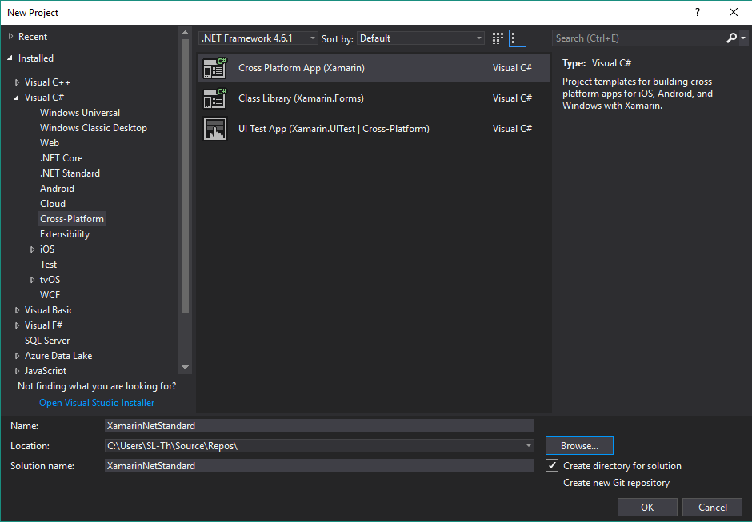
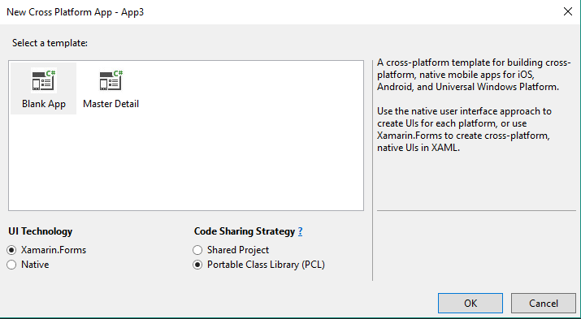
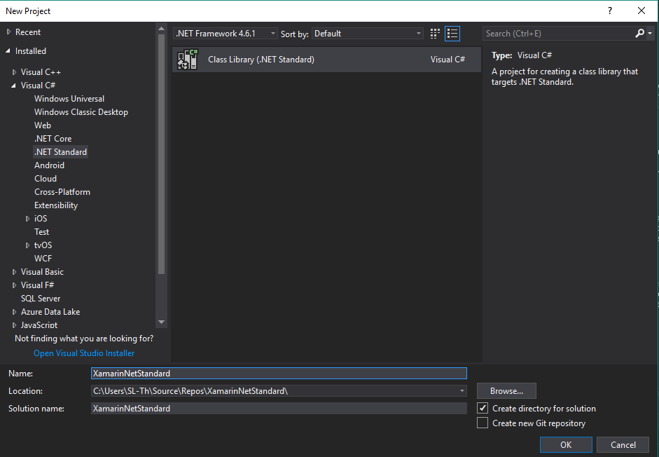

# Xamarin .Net Standard #

This project is a sample to create a .Net Standard project for Xamarin.

#### Used versions ####

* .Net Standard 2.0
* Xamarin.Forms 2.4.0.18342
* Microsoft.NETCore.Portable.Compatibility 1.0.1
* Microsoft.NETCore.UniversalWindowsPlatform 6.0.1
* Visual Studio 15.4.1
* Windows 1709 Fall Creators Update

Here you can check the compatibility of your installd versions:
[NetStandard support](https://docs.microsoft.com/en-us/dotnet/standard/net-standard)


## Setup your own Xamarin .Net Standard project ##




* Create a Cross-Plattform project with Xamarin (Blank App, Xamarin.Forms, PCL)
* Unload platform specific projects

### Portable project ###



* Create .Net Standard Library project
* Copy App.xaml and MainPage.xaml to new .Net Satndard project
* Remove old PCL project
* Choose .Net Standard in Properties of NetStandard project
* Edit .csproj file of .Net Standard project

```
<Project Sdk="Microsoft.NET.Sdk">
  <PropertyGroup>
    <TargetFramework>netstandard2.0</TargetFramework>
  </PropertyGroup>
</Project>
```

* Install packages with NuGet to .Net Standard project (Xamarin.Forms, Microsoft.NETCore.Portable.Compatibility)
* Rebuild your .Net Standard project and check for errors

### Android and iOS project ###

* Reload project
* Install same Xamarin.Forms version as installed at your .Net Standard project
* Add reference to your .Net Standard project
* Rebuild your platform specific project and check for errors

### UWP project ###

**For .Net Standard 2.0 you need to install the Fall Creators Update (1709)**

* Reload project
* Install same Xamarin.Forms version as installed at your .Net Standard project
* Add reference to your .Net Standard project
* Edit csproj file

Add new PropertyGroup

```
<PropertyGroup>
    <RestoreProjectStyle>PackageReference</RestoreProjectStyle>
</PropertyGroup>
```

Add ItemGroup with installed packages

```
<ItemGroup>
    <PackageReference Include="Microsoft.NETCore.UniversalWindowsPlatform">
      <Version>6.0.1</Version>
    </PackageReference>
    <PackageReference Include="Xamarin.Forms">
      <Version>2.4.0.18342</Version>
    </PackageReference>
</ItemGroup>
```

* Delete project.json file
* Rebuild your platform specific project and check for errors

For other Xamarin projects, check out my github repositories.